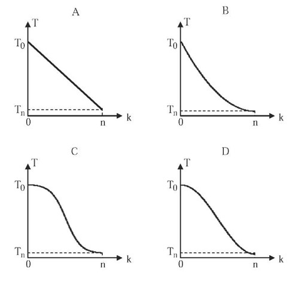
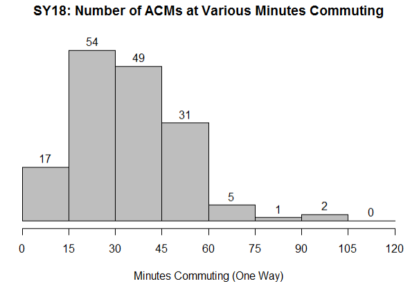

# Diverse Team Creation

How do you distribute a large pool of people into a fixed number of teams which maximizes racial and gender diversity, equally distributes beneficial skills and experiences, and conforms to certain rules like preventing prior relationship conflicts?

This type of problem falls into the general umbrella of combinatorial optimization, where we are interested in finding the best combination from a large pool of possibilities. For example, for a site of 80 AmeriCorps Members (ACMs) split into 8 equally sized teams, there are 5.9 x 10^61 possible combinations (for comparison, there are 8.1 x 10^67 ways to shuffle a deck of cards, which is regarded as practically infinite).

In this post, we go over how we implemented our solution to this problem so that others might adapt it to their own use case. This post was a collaborative effort between Alex Perusse and Chris Leudche, who co-developed this method, and is also available on (his blog.)[put your blog link here]

## Defining the Business Need

Each school year, City Year places thousands of AmeriCorps Members (ACMs) in hundreds of schools as near-peer tutors and mentors. For the vast majority of city locations, the solution was to do it by hand. Managers and Directors would do their best to make relatively "equal" teams.  As we will explore in greater detail, this solution is costly in terms of time and invites certain biases.  It was particularly challenging at sites with 200+ ACMs to place, like in City Year Chicago and Los Angeles, where the authors of this post reside.

In 2013, City Year Los Angles independently developed a solution using VBA and Excel. While this solutions was effective, it lacked the desired speed and usability. So in 2017, as a couple eager data science enthusiasts, we chose to build a solution from scratch in the R programming language.

## Researching Our Approach

Our first step was to survey the many classic cases involving optimal matches across two sets of items. We were careful to choose the appropriate model, since each approach would impose slightly different constraints on the attributes we could consider and our method of scoring "good" placements.

In cases like the [National Resident Match Algorithm](https://en.wikipedia.org/wiki/National_Resident_Matching_Program) and [Stable Marriage Problem](https://en.wikipedia.org/wiki/Stable_marriage_problem), each item of Sets A and B ranks the items on the other set, and the algorithm optimizes placements such that each item in a pair is comparably ranked by the other. While we could feasibly structure our problem similarly, it would require a large logistical lift to ask ACMs to rank schools, let alone asking schools to rank ACMs.

In the [Assignment Problem](https://en.wikipedia.org/wiki/Assignment_problem), a set of agents are matched to a set of tasks, and the goal is to minimize the aggregate cost of assignments. Rideshare solutions might use a similar approach in matching drivers to passengers while optimizing for things like proximity and number of passenger seats required (see also the [Nurse Scheduling Problem](https://en.wikipedia.org/wiki/Nurse_scheduling_problem)). In perhaps the most famous similar case, the [Traveling Salesman Problem](https://en.wikipedia.org/wiki/Travelling_salesman_problem) seeks to find the most optimal route an agent can travel between a list of destinations. These approaches are more aligned with our case, which requires the flexibility to include a number of different constraints and variables.

For each of the above cases, various algorithmic solutions exist. Ultimately we chose simulated annealing, which is a method of randomized iterative optimization  developed by Marshal Rosenbluth in 1953. While this approach could reasonably be applied to most cases above, its implementation for Traveling Salesman stood out in particular due to [a nicely compiled R project repository](http://toddwschneider.com/posts/traveling-salesman-with-simulated-annealing-r-and-shiny/). This provided the backbone from which we tailored our solution, and we can't understate the value of open source software in developing solutions like ours.

The research phase of our project provided an understanding of comparable problems and the language to express our need. With this knowledge we founded a weekly working group in Chicago's local civic tech community, [ChiHackNight](https://chihacknight.org/). We reached out for collaborators with any experience in Simulated Annealing or R, and we formed an enthusiastic group that served as an indispensable sounding board and development space for our implementation.

## Walkthrough of Simulated Annealing

Simulated annealing is a slightly more complex form of [hill climbing optimization](https://en.wikipedia.org/wiki/Hill_climbing). Understanding hill climbing is a helpful scaffolding step to understanding simulated annealing, and you will see why hill climbing alone is insufficient for our case.

Suppose we are placing ACMs onto teams, and we use a loss function to determine the error for a given placement relative to the "ideal" placement. The hill climbing algorithm would operate as:

```
  1. Start with random placements of ACMs onto teams
  2. Calculate the baseline loss
  3. For each iteration up to max:
     1. Choose two ACMs at random and swap their team assignment
     2. Calculate new loss
     3. If new loss < baseline
         * then keep the swap and update baseline to be the new score
         * otherwise swap back
```

Essentially, we try various placements and only update our placements when we find a better alternative. If we do this for long enough, the algorithm will converge to a particular placement, which we hope is the global minimum of the space defined by our loss function (i.e. the best possible placement). Incidentally, this method was the one originally implemented in CYLA.

Unfortunately, this is not often the case, as the hill climbing algorithm suffers from a deal-breaking restriction.

To explain, let's start with what we mean by "the space defined by our loss function."  This is the space of all possible team placements with the corresponding score.   Hill climbing works well when the loss space has a single optimum, like this:


However our loss space is quite different. Instead of being 3-dimensional with a single peak, our loss space has 11 dimensions and many peaks and troughs. As we add complexity to the loss function by measuring more and more variables about the ACMs, this loss space becomes correspondingly multidimensional. If we were to picture a similarly complex 3-dimensional equivalent, it might look like this:


In such a complex space, the hill climbing algorithm  will tend to converge to one of the many dips, but not likely the lowest possible point.

The simulated annealing algorithm offers a solution to the problem with just a slight adjustment to hill climbing.  What we need is a strategy which can *explore a series of worse placements*.  While hill climbing gets stuck in areas where *any swap leads to a worse placement*, simulated annealing allows for worse placements. Therefore we can escape the lip of the small dip if we get stuck, and we can then potentially find an even lower point.

Simulated annealing gets its name from metallurgy, where the annealing of metals involves heating them up and then slowly cooling to ultimately reduce the defects in the metal.  Analogously, in our simulated annealing algorithm, there is a "temperature" component which corresponds to the probability that we will accept a worse placement. When the temperature is high, the algorithm is more likely to accept a placement which is worse than the one it is currently at.  However, as the temperature "cools" over the course of the run, the algorithm becomes more conservative and less likely to accept a worse placement. We can adapt the algorithm from before to include these details:

```
  1. Randomly place ACMs onto teams
  2. Calculate the baseline loss and initialize temperature
  3. For each iteration up to max:
     1. Choose two ACMs at random and swap their teams
     2. Calculate new score and update temperature/acceptance probability
     3. If new loss < baseline
         * then keep the swap and update baseline to be the new loss
         * otherwise:
            * draw random number between 0 and 1
            * if the random number is < the acceptance probability
              * then keep swap and update baseline
              * else revert swap
```

## Defining the Loss Function

Since we have many different variables contributing to the loss of the placement, we need to build a loss function for each individual variable.  This requires some choices be made about *how* we will calculate loss the age distribution.  For some variables, this was fairly straightforward.  For example, for education experience we set ideal targets at each school for the numbers of high school graduate and ACMs with some college experience.  This set the ideal number of ACMs from those two subgroup for each team according to distributing them equally to each team.  Then at each iteration we would simply take the difference in desired ACMs from that subgroup and the actual, and the square the result. For other variables we would calculate values like the variance of the ages of the team compared to the variance of the ages of the Corps at he site, and take the absolute value of their difference.  Once we had calculated the individual losses for each variable, we would add them up to get the total loss.  

One way we improved the efficiency of this process was to pre-process the data by changing categorical variables into a series of boolean columns.

### Losses on Different Scales

One issue we encountered was that our losses were on dramatically different scales.  Some were small values in the tens to hundreds, others were millions.  This imbalance caused a need for us to attempt to balance each loss and then also apply a weighting method at the end so that we can vary the importance of each input.

## Flattening the Search Space

In an early stage of our solution, we implemented a scoring function that penalized team placements that violated a set of firm constraints. For example, if two roommates were placed on the same school team, we worsened the placement loss by a factor of 10 to disincentivize the match. However, this approach restricted the search behavior of the algorithm by creating large peaks and valleys in the search space.

For example, we want to ensure that Spanish speaking ACMs are placed at schools with greater Spanish speaking need. When we heavily penalized invalid placements based on Spanish speakers, we discovered that these ACMs would get stuck in the first valid placement the algorithm found for them. In order to consider alternative placements for the Spanish speakers, the algorithm would either need to randomly swap two Spanish speakers or accept a dramatically inflated loss in an intermediary step before finding better placements for them.

We solved this by writing firm constraints such that certain placements would never occur. When two ACMs are selected to be swapped, the algorithm references two pre-calculated tables that represent each ACM's eligibility to serve at each school and each ACM's eligibility to serve with each other ACM (to prevent roommate and prior relationship conflicts). With more constraints hard-coded into the algorithm, we flattened the search space such that the algorithm explores only valid placements and does not get 'stuck' when it places ACMs in the first valid slot that it finds.

## Scheduling the Annealing Process

Another detail we needed to consider was at what schedule we wanted to reduce our temperature and thus volatility in the swaps made. Some considerations.  If our schedule cools too quickly, then we aren't garunteed to find the optimum because we might converge to a local minimum.  However, if our schedule is too long, then our algorithm might not converge in the set number of iterations I give it.  Here are a couple of examples of different curves we could have used for cooling:

A) Linear B) Quadratic C) Exponential D) Trionometric


In our case, we found exponential to be a good option.  The equation, of the form `f(x, c, w) = 1 / (1 + exp((x - c) / w))`, has two parameters, `c` and `w`, which very flexibly allowed to change when and at what rate the temperature would go from high to low. We then experimented with different values of c and w and observed the corresponding placements that came out in a fixed number of iterations to choose our preferred values for c and w. 

## Results

Implementing this solution has yielded several benefits. For one, we drastically cut the time commitment necessary from our staff. Completing all placements by hand required thousands of worker hours across the national network. Last year, approximately 350 program managers spent 4 to 8 hours each to complete placements, totaling 1,400 to 2,800 hours. Second, our approach removes unconscious bias from the process. When managers chose their own teammates, it invited like-me biases and other forms of unconscious bias, causing team demographics to deviate from the mean.

Another large benefit of our approach was improved commute times. In Chicago, commute had never been considered before, which lead to enormous inefficiency in placements. In the 2017 school year, the average ACM was placed at the 13th closest school to their home address. Chicago had 26 school partners, so this represents commute performance no better than random placement.




The number of ACMs commuting longer than 60 minutes was drastically cut. For each school day in 2018, Chicago's ACMs commute 114 hours less than in 2017. Over the course of the 2018 school year (150 in-school days), the average ACM commutes 90 hours less than in 2017. ACMs already work 10 hours per day in our program, so this improvement is tremendously welcome from their perspective.

## Advocating for the Solution
